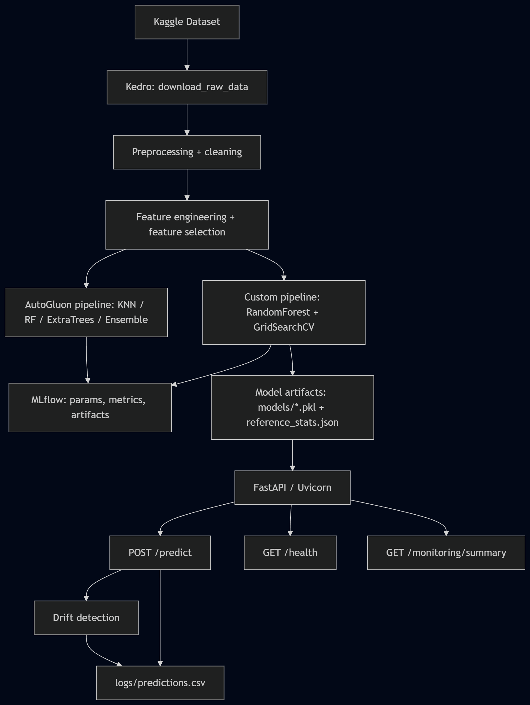

# RevRate - przewidywanie cen samochodow

RevRate to projekt uczenia maszynowego do predykcji ceny samochodu na podstawie danych z ogloszen sprzedazy samochodow w Polsce. Problem jest rozwiazywany jako regresja: model otrzymuje parametry pojazdu, a zwraca przewidywana cene w PLN.

Projekt obejmuje kompletny przeplyw ML: baseline w notebooku, pipeline Kedro, eksperymenty MLflow, porownanie modeli, AutoML z AutoGluon, lokalne API FastAPI oraz prosty monitoring predykcji i driftu danych.

## Spis tresci

- [Opis problemu](#opis-problemu)
- [Dane](#dane)
- [Architektura systemu](#architektura-systemu)
- [Struktura projektu](#struktura-projektu)
- [Instalacja](#instalacja)
- [Uruchomienie pipeline'ow](#uruchomienie-pipelineow)
- [MLflow](#mlflow)
- [API predykcyjne](#api-predykcyjne)
- [Monitoring i drift danych](#monitoring-i-drift-danych)
- [Wyniki modeli](#wyniki-modeli)
- [Automatyzacja MLOps](#automatyzacja-mlops)
- [Najwazniejsze pliki](#najwazniejsze-pliki)

## Opis problemu

Celem projektu jest oszacowanie ceny samochodu na rynku wtornym i pierwotnym na podstawie cech takich jak marka, model, rocznik, przebieg, moc, pojemnosc silnika, paliwo, skrzynia biegow, typ nadwozia, kolor oraz lokalizacja oferty.

Model moze byc uzyty jako lokalna usluga wspierajaca szybka wycene pojazdu. Dla nowego ogloszenia API zwraca:

- przewidywana cene w PLN,
- informacje, czy dane wejsciowe odbiegaja od danych treningowych,
- liste ostrzezen driftu danych.

## Dane

Zrodlem danych jest dataset Kaggle:

```text
bartoszpieniak/poland-cars-for-sale-dataset
```

Pipeline korzysta z pliku:

```text
data/Car_sale_ads.csv
```

Jezeli plik nie istnieje lokalnie, node `download_raw_data` probuje pobrac dataset przez API Kaggle. Dane lokalne nie sa wersjonowane w Git, poniewaz plik CSV jest duzy.

Najwazniejsze kolumny w danych:

- `Price` - cena pojazdu, czyli zmienna docelowa,
- `Currency` - waluta ceny; wartosci w EUR sa przeliczane na PLN,
- `Condition`, `Vehicle_brand`, `Vehicle_model`, `Production_year`,
- `Mileage_km`, `Power_HP`, `Displacement_cm3`,
- `Fuel_type`, `CO2_emissions`, `Drive`, `Transmission`,
- `Type`, `Doors_number`, `Colour`, `Offer_location`.

Do pobierania danych z Kaggle potrzebny jest token API. Przykladowy szkielet znajduje sie w pliku:

```text
kaggle.example.json
```

Najprostsza konfiguracja na Windows:

```powershell
mkdir $env:USERPROFILE\.kaggle
copy kaggle.json $env:USERPROFILE\.kaggle\kaggle.json
```

Alternatywnie mozna trzymac prawdziwy plik `kaggle.json` w katalogu projektu i ustawic:

```powershell
$env:KAGGLE_CONFIG_DIR = (Get-Location).Path
```

Prawdziwy `kaggle.json` jest ignorowany przez Git i nie powinien trafic do repozytorium.

## Architektura systemu

Wizualizacja architektury znajduje sie w pliku `diagram.png`.



Przeplyw systemu:

1. Dane sa pobierane z Kaggle albo czytane lokalnie z `data/Car_sale_ads.csv`.
2. Kedro uruchamia pipeline treningowy.
3. Custom pipeline wykonuje czyszczenie, imputacje brakow, inzynierie cech, selekcje cech, preprocessing, strojenie `RandomForestRegressor` i ewaluacje.
4. Pipeline AutoGluon trenuje i porownuje kilka modeli AutoML.
5. MLflow zapisuje parametry, metryki, wykresy, leaderboardy i artefakty modeli.
6. Wytrenowany model custom jest zapisywany w `models/` i udostepniany przez lokalne API FastAPI.
7. API zapisuje predykcje do `logs/predictions.csv` i porownuje requesty ze statystykami referencyjnymi z `models/reference_stats.json`.
8. GitHub Actions uruchamia szybkie kontrole techniczne projektu po zmianach w repozytorium.

## Struktura projektu

```text
conf/base/catalog.yml                         definicje artefaktow Kedro
conf/base/parameters.yml                      konfiguracja pipeline'ow
notebooks/pipeline.ipynb                      notebook baseline: EDA, preprocessing, model bazowy, ewaluacja
src/revrate/pipeline_registry.py              rejestr pipeline'ow Kedro
src/revrate/pipelines/custom_pipeline/        reczny pipeline ML
src/revrate/pipelines/autogluon_pipeline/     pipeline AutoML
src/revrate/api/app.py                        lokalne API FastAPI
.github/workflows/ci.yml                      workflow CI
diagram.png                                   diagram architektury
data/                                         lokalne dane, ignorowane przez Git
models/                                       lokalne modele, ignorowane przez Git
logs/                                         lokalne logi predykcji, ignorowane przez Git
mlflow.db                                     lokalna baza MLflow, ignorowana przez Git
```

## Instalacja

Wymagane srodowisko:

- Python,
- pip,
- token Kaggle, jezeli dane maja byc pobierane automatycznie,
- system Windows lub inny system z dostepem do Pythona i zaleznosci z `requirements.txt`.

Instalacja srodowiska lokalnego:

```powershell
python -m venv .venv
.\.venv\Scripts\activate
python -m pip install --upgrade pip
pip install -r requirements.txt
```

Zaleznosci projektu obejmuja m.in.:

- Kedro,
- pandas,
- scikit-learn,
- MLflow,
- AutoGluon,
- FastAPI,
- Uvicorn,
- Kaggle API.

## Uruchomienie pipeline'ow

Domyslnym pipeline'em Kedro jest `custom_pipeline`, wiec ponizsza komenda uruchamia reczny wariant treningu:

```powershell
python -B -m kedro run
```

Jawne uruchomienie custom pipeline:

```powershell
python -B -m kedro run --pipelines custom_pipeline
```

Uruchomienie pipeline'u AutoGluon:

```powershell
python -B -m kedro run --pipelines autogluon_pipeline
```

### Custom pipeline

Custom pipeline obejmuje:

- pobieranie danych z Kaggle albo uzycie lokalnego CSV,
- czyszczenie danych i usuwanie obserwacji odstajacych,
- przeliczenie cen z EUR na PLN,
- filtrowanie rocznikow, przebiegu, mocy i typow paliwa,
- imputacje brakow na podstawie podobnych samochodow oraz imputery mediany i dominanty,
- inzynierie cech: `car_age`, `mileage_per_year`, `power_to_displacement`, `age_x_mileage`, `voivodeship`,
- selekcje cech na podstawie waznosci z Random Forest,
- preprocessing numeryczny i kategoryczny,
- strojenie hiperparametrow przez `GridSearchCV`,
- trening `RandomForestRegressor`,
- ewaluacje metrykami RMSE, MAE i R2,
- zapis artefaktow do katalogu `models/`,
- logowanie eksperymentow do MLflow.

Zapisywane artefakty:

```text
models/custom_model.pkl
models/custom_preprocessor.pkl
models/custom_top_features.pkl
models/reference_stats.json
```

### Pipeline AutoGluon

Pipeline AutoGluon obejmuje:

- pobieranie tych samych danych,
- preprocessing i inzynierie cech,
- podzial train/test,
- trening modeli AutoML,
- ewaluacje najlepszego modelu,
- zapis modeli AutoGluon w `models/autogluon_models/`,
- logowanie leaderboardu, metryk i artefaktow w MLflow.

W obecnej konfiguracji AutoGluon porownuje m.in.:

- KNeighbors,
- RandomForest,
- ExtraTrees,
- WeightedEnsemble.

Modele AutoGluon sa zapisywane w katalogach:

```text
models/autogluon_models/run_YYYYMMDD_HHMMSS/
```

## MLflow

Eksperymenty sa logowane lokalnie przez MLflow. Domyslny tracking URI jest ustawiony na:

```text
sqlite:///mlflow.db
```

Uruchomienie interfejsu MLflow:

```powershell
python -B -m mlflow ui --backend-store-uri sqlite:///mlflow.db
```

Po starcie UI jest dostepne pod adresem:

```text
http://127.0.0.1:5000
```

W custom pipeline logowane sa m.in.:

- najlepsze hiperparametry,
- metryki treningowe i testowe,
- liczba probek i cech,
- wykres predykcji wzgledem wartosci rzeczywistych,
- histogram reszt,
- waznosci cech,
- model zarejestrowany jako `revrate_custom_rf`.

W pipeline AutoGluon logowane sa:

- konfiguracja AutoGluon,
- leaderboard modeli,
- metryki testowe,
- katalog artefaktow AutoGluon.

## API predykcyjne

Po uruchomieniu `custom_pipeline` mozna wystartowac lokalne API:

```powershell
python -B -m uvicorn src.revrate.api.app:app --host 127.0.0.1 --port 8000
```

Dostepne endpointy:

```text
GET  /health
POST /predict
GET  /monitoring/summary
```

Swagger UI:

```text
http://127.0.0.1:8000/docs
```

API korzysta z artefaktow zapisanych przez `custom_pipeline`, dlatego przed wykonaniem predykcji powinny istniec:

```text
models/custom_model.pkl
models/custom_preprocessor.pkl
models/custom_top_features.pkl
models/reference_stats.json
```

Endpoint `/health` pozwala sprawdzic, czy API dziala i czy statystyki referencyjne sa dostepne. Model jest ladowany przy pierwszym wywolaniu `/predict`, dlatego pierwsza predykcja moze byc wolniejsza.

Przykladowe zapytanie:

```powershell
$body = @{
  Condition = "Used"
  Vehicle_brand = "Toyota"
  Vehicle_model = "Corolla"
  Production_year = 2018
  Mileage_km = 85000
  Power_HP = 132
  Displacement_cm3 = 1598
  Fuel_type = "Gasoline"
  CO2_emissions = 139
  Drive = "Front wheels"
  Transmission = "Manual"
  Type = "sedan"
  Doors_number = 4
  Colour = "white"
  voivodeship = "mazowieckie"
} | ConvertTo-Json

Invoke-RestMethod `
  -Uri "http://127.0.0.1:8000/predict" `
  -Method Post `
  -ContentType "application/json" `
  -Body $body
```

Odpowiedz `/predict` zawiera:

```text
predicted_price
currency
drift_detected
drift_warnings
```

## Monitoring i drift danych

API zapisuje kazda predykcje do lokalnego pliku:

```text
logs/predictions.csv
```

W logu sa zapisywane:

- timestamp predykcji,
- przewidziana cena,
- czas obslugi requestu,
- informacja, czy wykryto drift,
- lista ostrzezen driftu,
- wejscie requestu jako JSON.

Drift detection opiera sie na pliku:

```text
models/reference_stats.json
```

Plik jest generowany przez `custom_pipeline` i zawiera statystyki referencyjne danych treningowych. API stosuje proste reguly:

- dla cech numerycznych sprawdza, czy wartosc wychodzi poza zakres percentyli `p01-p99`,
- dla cech kategorycznych sprawdza, czy wartosc wystepowala w danych treningowych.

Podsumowanie monitoringu:

```text
GET /monitoring/summary
```

Endpoint zwraca m.in. liczbe predykcji, liczbe predykcji z wykrytym driftem, wspolczynnik driftu, czas ostatniej predykcji i sciezke do pliku logow.

## Wyniki modeli

Metryki dla zbioru testowego:

| Model | Val RMSE | Test RMSE | Test MAE | Test R2 |
|---|---:|---:|---:|---:|
| Custom RandomForest + GridSearchCV | - | **10110.71** | **5780.98** | **0.9199** |
| AutoGluon KNeighbors | 21782.49 | 22351.45 | 14837.13 | 0.6138 |
| AutoGluon RandomForest | 11299.58 | 11400.61 | 6652.61 | 0.8995 |
| AutoGluon ExtraTrees | 11447.63 | 11337.18 | 6754.93 | 0.9006 |
| AutoGluon WeightedEnsemble | 11209.69 | 11229.80 | 6595.02 | 0.9025 |

Wniosek: najlepszy wynik na zbiorze testowym uzyskal recznie przygotowany `RandomForestRegressor` po selekcji cech i strojeniu hiperparametrow przez `GridSearchCV`.

## Automatyzacja MLOps

Repozytorium zawiera workflow GitHub Actions:

```text
.github/workflows/ci.yml
```

Workflow uruchamia sie po:

- `push`,
- `pull_request`,
- recznym uruchomieniu przez `workflow_dispatch`.

CI wykonuje szybkie kontrole techniczne:

- instaluje zaleznosci z `requirements.txt`,
- sprawdza skladnie plikow Python w `src/`,
- sprawdza, czy Kedro rejestruje pipeline'y `custom_pipeline`, `autogluon_pipeline` i `__default__`,
- sprawdza, czy FastAPI buduje schemat OpenAPI i zawiera endpointy `/health`, `/predict`, `/monitoring/summary`.

CI nie trenuje modelu i nie pobiera danych z Kaggle. Te kroki sa ciezsze, wymagaja lokalnych danych lub tokenu Kaggle i sa uruchamiane recznie.

Ponowne trenowanie modelu:

```powershell
python -B -m kedro run --pipelines custom_pipeline
```

Lokalne wdrozenie modelu:

```powershell
python -B -m uvicorn src.revrate.api.app:app --host 127.0.0.1 --port 8000
```

Po starcie API model jest dostepny przez endpoint `/predict`, a monitoring przez `/monitoring/summary`.

## Najwazniejsze pliki

```text
README.md
requirements.txt
kaggle.example.json
diagram.png
conf/base/parameters.yml
conf/base/catalog.yml
src/revrate/pipeline_registry.py
src/revrate/pipelines/custom_pipeline/nodes.py
src/revrate/pipelines/autogluon_pipeline/nodes.py
src/revrate/api/app.py
notebooks/pipeline.ipynb
```

## Uwagi praktyczne

- Katalogi `data/`, `models/`, `logs/`, `mlruns/` oraz plik `mlflow.db` sa lokalnymi artefaktami pracy i nie powinny byc commitowane.
- Plik `models/custom_model.pkl` moze byc bardzo duzy, dlatego pierwsze ladowanie modelu w API moze trwac kilka sekund.
- Jezeli `data/Car_sale_ads.csv` juz istnieje, pipeline uzywa lokalnej kopii i nie pobiera danych ponownie.
- Jezeli chcesz wymusic ponowne pobranie danych, zmien `custom.data_download.force_download` w `conf/base/parameters.yml` na `true`.
